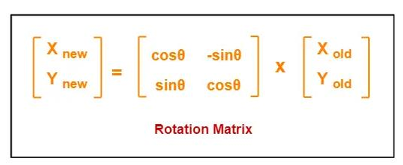
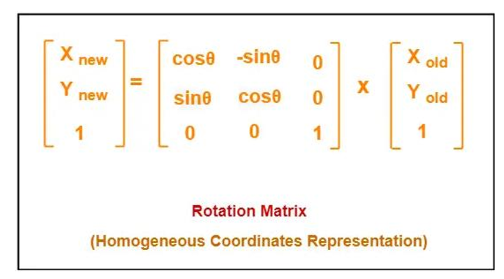
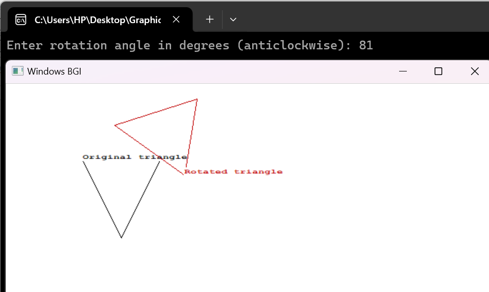

# 🎯 2D Rotation

**Rotation** is a transformation that turns a shape around a fixed point (usually the origin or the shape's center) by a given angle. In 2D computer graphics, this is done using trigonometric functions to calculate the new coordinates of each point after rotation.

---

## 🧮 **Algorithm for 2D Rotation**

1. Start the graphics mode using `initgraph()`.
2. Define the coordinates of the shape (triangle or rectangle).
3. Calculate the centroid (if rotating around the center of the shape).
4. Ask the user to enter the rotation angle (in degrees).
5. Convert the angle from degrees to radians:  
   `angleRad = angleDeg × π / 180`
6. For each vertex of the shape:
   - Translate the point to the origin (if rotating around the centroid).
   - Apply rotation using the formulas:  
     - `x' = x * cos(θ) - y * sin(θ)`  
     - `y' = x * sin(θ) + y * cos(θ)`
   - Translate the point back (if required).
7. Draw the original and rotated shapes with different colors.
8. Wait for user input, then close the graphics window.

---

## 📐 Matrix Form

In matrix form, the rotation equations can be written as:

- The **homogeneous coordinates** representation of a point **(X, Y)** is **(X, Y, 1)**.
- This representation allows all transformations (translation, rotation, scaling) to be performed using **matrix-vector multiplications**.

---

### 🧾 **Rotation Matrix Representation in Homogeneous Coordinates**

To rotate a point by angle `θ` about the origin, the transformation matrix is:

---

## 🖼️ 2D Rotation Visualization

Here is a visual example of how the 2D Rotation algorithm transforms a shape:

---

## 📄 Documentation

For a more detailed explanation of the 2D Rotation algorithm, check out the full documentation:

[📎 Click here for Documentation](https://drive.google.com/file/d/1ds9uqyQL3xvSFV_Z508cQtm7WusEv3q_/view?usp=sharing)

---

## 🛠️ Required Tools

- **Dev-C++ IDE**
- **WinBGIm Graphics Library** (included with or added to Dev-C++)
- **C++ Compiler** (such as TDM-GCC that comes with Dev-C++)
- **Windows Operating System** (Graphics.h is platform-specific)
